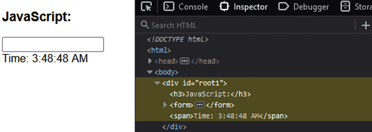

## React

[React 이해를 위한 필독문서](https://overreacted.io/ko/react-as-a-ui-runtime/)

---
### 1. React - 언제 리렌더링 되는가?

- 렌더링이란?  
-> 이미지를 생성하는 과정을 설명한다..

### <strong>DOM (Document Object Model)</strong>
- 웹 사이트에서 화면에 표시되는 내용을 HTML을 통해 표현하는 것을 의미함.
- javascript API를 통해 DOM을 수정할 수 있다.
	- document.appendChild / removeChild / setAttribute 등이 있다.
	- React에서는 이런 API를 직접 호출하지 않고 React가 처리한다.

 

### <strong>VDOM (virtual DOM)</strong>
리액트의 근본..!  
[React VDOM 이란?](https://blog.logrocket.com/virtual-dom-react/)  

 

js dom에서는 이렇게 `setInterval()` 함수를 사용하면 실행될 때 마다 DOM을 다시 그리게 된다.  
그러면 input 부분도 다시 그려야한다. 

여러 js framework 에서 다양한 솔루션을 제시했는데, 그 중 리액트가 제시한 방법이 VDOM 이다.  

<u>특정 컴포넌트만 리렌더 하기 위해 React에서 구현한 부분 => VDOM</u>  

--- 
 

### virtual DOM 특징
- 훨씬 가벼운 Replica
	- 백업과 성능 향상을 위해 여러곳에 복제하는 행위를 Replication 이라고 한다. 

 

- 브라우저 메모리 save
- 브라우저를 직접 바꾸지 않음.
- actual DOM에 비해 빠르다고 할 수 있는지? 
	- **_No._** 그렇지는 않다. VDOM은 UI를 다시 렌더링할 때 actual DOM이 최소한의 DOM 작업을 계산할 수 있도록 하는 메커니즘을 제공한다.
- 어떤 element가 변경됐는지 이전의 스냅샷과 비교하여 변경된 element만 업데이트 한다.

 

---

### React는 어떻게 virtual DOM을 구현할까?
- 중요한 개념 두 가지!
1. 리렌더링 (rendering)
	- 데이터가 렌더되고 app change 되면 업데이트 하기 위해 리액트가 자동으로 VDOM tree를 생성한다.
	
 

2. 재조정 (reconciliation)
	- virtual DOM은 가상적인 표현을 메모리에 저장하고 ReactDOM 과 같은 라이브러리에 의해 실제 DOM과 동기화 하는 프로그래밍 개념
	- 이 과정을 재조정(reconciliation) 이라고 한다.

 

 
이렇게 업데이트 VDOM에서 변경사항을 메모리에 저장하고 actual DOM에 동기화 한다.

 

 

 

그렇게 되면 상태가 변경되는 부분만 리렌더된다.

---

- 언제 상태 변경 되는가?