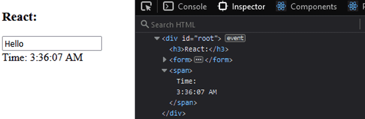

## React

[React 이해를 위한 필독문서](https://overreacted.io/ko/react-as-a-ui-runtime/)

---

### 1. React - 언제 리렌더링 되는가?

- 렌더링이란?
  - 이미지를 생성하는 과정

### <strong>DOM (Document Object Model)</strong>

- 웹 사이트에서 화면에 표시되는 내용을 HTML을 통해 표현하는 것을 의미함.
- javascript API를 통해 DOM을 수정할 수 있다.
  - document.appendChild / removeChild / setAttribute 등이 있다.
  - React에서는 이런 API를 직접 호출하지 않고 React가 처리한다.

</br>

### <strong>VDOM (virtual DOM)</strong>

리액트의 근본..! </br>
[React VDOM 이란?](https://blog.logrocket.com/virtual-dom-react/) </br>

</br>

js dom에서는 이렇게 `setInterval()` 함수를 사용하면 실행될 때 마다 DOM을 다시 그리게 된다. </br>
그러면 input 부분도 다시 그려야한다.</br>

여러 js framework 에서 다양한 솔루션을 제시했는데, 그 중 리액트가 제시한 방법이 VDOM 이다. </br>

<u>특정 컴포넌트만 리렌더 하기 위해 React에서 구현한 부분 => VDOM</u> </br>

---
</br>

### virtual DOM 특징

- 훨씬 가벼운 Replica
  - 백업과 성능 향상을 위해 여러곳에 복제하는 행위를 Replication 이라고 한다.

</br>

- 브라우저 메모리 save
- 브라우저를 직접 바꾸지 않음.
- actual DOM에 비해 빠르다고 할 수 있는지?
  - **_No._** 그렇지는 않다. VDOM은 UI를 다시 렌더링할 때 actual DOM이 최소한의 DOM 작업을 계산할 수 있도록 하는 메커니즘을 제공한다.
- 어떤 element가 변경됐는지 이전의 스냅샷과 비교하여 변경된 element만 업데이트 한다.

</br>

---

### React는 어떻게 virtual DOM을 구현할까?

- 중요한 개념 두 가지!

1. 리렌더링 (rendering)

- 데이터가 렌더되고 app change 되면 업데이트 하기 위해 리액트가 자동으로 VDOM tree를 생성한다.

</br>

2. 재조정 (reconciliation)

- virtual DOM은 가상적인 표현을 메모리에 저장하고 ReactDOM 과 같은 라이브러리에 의해 실제 DOM과 동기화 하는 프로그래밍 개념
- 이 과정을 재조정(reconciliation) 이라고 한다.

</br>


</br>
이렇게 업데이트 VDOM에서 변경사항을 메모리에 저장하고 actual DOM에 동기화 한다.

</br>

</br>

</br>

그렇게 되면 상태가 변경되는 부분만 리렌더된다.

---

### 리렌더링

VDOM이 업데이트되면, React는 이전의 VDOM 스냅샷과 비교한 뒤 실제 DOM에서 변경된 내용만 업데이트합니다. 아무것도 변경되지 않으면 전혀 업데이트되지 않습니다.

이전 VDOM과 새 VDOM을 비교하는 이 프로세스를 diffing이라고 합니다.

- 성능에 어떤 영향이 있는가?
대부분 render 함수의 실행에 대해서만 말하지만 렌더링이 항상 UI 업데이트를 의미하지는 않는다.

### 리렌더링 예시

```jsx
const App = () => {
  const [message, setMessage] = React.useState('');
  return (
    <>
      <Tile message={message} />
      <Tile />
    </>
  );
};
```

부모 컴포넌트의 상태가 변경되었을 때 자식 컴포넌트는 props 유무 여부에 상관없이 모두 리렌더링 된다.

리렌더가 3번이 되는건가?

- 렌더 함수가 3번 호출되는 것처럼 해석되지만, actual dom 수정은 message를 porps로 받는 첫번째 Tile 컴포넌트에서 1번만 발생함.


<strong>
 - 빨간점이 리렌더링 </br>
 - React에서는 render함수를 호출하는 것을 의미함 </br>
 - Actual DOM에서는 UI를 다시 그리는 것을 의미함
</strong>

😀 👍 Actual DOM에서는 하나의 컴포넌틔 UI만 다시 그려진거지만,

😭 👎 VDOM에서는 모든 컴포넌트의 render함수가 실행되었다는 것 ㅠㅠ

---

### 리액트는 언제 리렌더링 될까?

- 컴포넌트의 상태가 변경될 때마다 렌더링을 예약한다. (즉시 수행 X, React가 적합한 순간을 찾기 위해 노력함)
- 상태를 변경한다는 것 : setState / useState 를 실행할 때
  - 컴포넌트의 render 함수가 호출됨
  - props 변경 여부와 관계없이 모든 하위 컴포넌트들이 리렌더링 됨

### props가 변경될 때, React 컴포넌트가 업데이트되지 않는 이유는 무엇인가요?

- props가 setState를 통해 올바르게 업데이트되지 않은 경우.
- props에 대한 참조가 동일하게 유지된 경우.

**props 객체를 직접 변경하는 것은 변경 사항을 트리거하지 않으며 React가 변경 사항을 인식하지 못하기 때문에 허용되지 않습니다.**

```jsx
this.props.user.name = 'Felix';
```

**이렇게 하지 마세요!**

부모 컴포넌트의 상태를 변경해야 합니다.

---

### 렌더링 성능을 더 효과적으로 향상시킬 수 있는 방법

1. React.memo

- React Hook 컴포넌트에서 props가 변경되지 않았을 때 렌더링 되는 것을 방지하는 함수

2. key 속성을 설정하기

- map으로 배열 돌릴때 key 속성 설정. 안하면 오류남. 일반적으로 React에서 수행해야하는 것.
- React는 첫 번째 원소와 이후 모든 원소들이 변경되었다 생각하고 해당 요소를 리렌더링 합니다. 요소에 key 속성을 추가함으로써 이를 방지할 수 있습니다.
- 배열의 인덱스를 key로 사용하는 것을 피하고 내용을 식별하는 것을 key로 사용하세요.

3. 컴포넌트의 구조 재구성 하기

- 예시) 상태를 처리하는 코드를 별도의 컴포넌트로 이동시킴