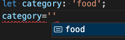

## TypeScript
#

```bash
npx ts-node
```
사용하면 별다른 설치 없이 간단히 터미널에서 ts를 사용할 수 있다.
#

### 1. 타입 지정

#### 1) 변수 타입 설정
```ts
let name: string;
let age: number;

// O -> 문제 없음. 각 타입에 맞게 할당됨.
name='홍길동';
age=13;


// X -> 타입에 맞지 않게 선언하면 해당 형식에 할당할 수 없다는 에러가 난다.
name=13;
age='홍길동';
```

#### 2) 객체 타입 설정
```ts
let human: {
	name: string;
	age: number;
}

// O : 문제 없음
human={name: '홍길동', age: 13};


// X -> age 선언 안함. age 속성이 필수라는 에러가 남.
human={name: '홍길동'}

```

#### 3) 객체 타입 선언 후 재사용
interface 와 type 중 type을 사용할 예정..<br/>
-> 무슨 차이가 있는지? <br/>
타입은 새 프로퍼티를 추가하도록 개방될 수 없는 반면, 인터페이스의 경우 항상 확장될 수 있다는 점입니다.

<br />

```ts
// type 선언
type Person = {
	name: string;
	age: number;
};

// boy에 Person의 type을 준다.
let boy: Person;

// O -> 문제 없음.
boy = {
	name: '홍길동',
	age: 13,
};

// X -> 필수 값 없음. (age 없음)
boy = {
	name: '홍길동',
};

// X -> 'number' 형식은 'string' 형식에 할당할 수 없습니다.
boy = {
	name: 13,
};
```

<br/>

#### 4) 함수 타입 선언 후 재사용

```ts
function add(x: number, y: number): number {
	return x + y;
}

// O -> 문제 없음. return 4
add(1, 3);

// X -> 'string' 형식은 'number' 형식에 할당할 수 없습니다.
add('a',1);

// X -> 필수 값 없음.
add();
```

<br/>

#### 5) 정해진 값으로 타입 설정 -> Union에서 사용됨.
```ts
let category: 'food';

// O 
category = 'food';

// X -> '"desk"' 형식은 '"food"' 형식에 할당할 수 없습니다.
category = 'desk';
```

<br /> typescript에서는 어떤 값이 들어가야 하는지 알려준다!

<br/>

#### 6) 배열 타입 설정
```ts
// number로 이루어진 배열
let numbers: number[];

// O -> 문제없음.
numbers = [1, 2, 3];
numbers = [];

// X -> 'string' 형식은 'number' 형식에 할당할 수 없습니다.
numbers = ['a', 'b', 'c'];
```
<br/>
좀 더 깐깐하게 배열 타입을 관리하고 싶다면? <br/>
=> <strong>Tuple 사용</strong>


```ts
// any 형식으로 선언 -> 타입 상관없이 아무거나 막 넣어도 ok..
let anytings: any[];
anytings = [1, 'a'];

// 배열의 형식, 길이 선언
let pair: [string, number];

// O -> 문제 없음.
pair = ['a', 1];

// X -> 길이가 맞지 않음. 대상에서 2개만 허용합니다.
pair = ['a', 1, 2];

// X -> 형식이 맞지 않음.
pair = [1, 'a'];
```

<br/>

### 2. 타입 추론
매번 타입을 선언해줘야 하는가? <br/>
No. 처음 값을 선언하면 알아서 타입을 추론한다. 안써줘도 됨.

```ts
// 타입 추론. 위 아래가 동일한 결과를 가짐.
const boy: string = '홍길동';
const boy = '홍길동';


// X -> boy의 타입을 string으로 선언했기 때문에 타입 에러가 남.
let boy = '홍길동';
boy = 1; //'number' 형식은 'string' 형식에 할당할 수 없습니다.
```
<br/>

### 3. Union Type => 합집합
여러 타입 중 하나만 되도 타입 조건 만족함. <br/>

```ts
// type 선언
type bool = true | false;

let flag: bool;

// O -> 문제 없음.
flag = true;
flag = false;

// X -> 'number' 형식은 'bool' 형식에 할당할 수 없습니다.
flag = 1;
```
<br/>

매개변수를 제한할 때 유용하게 사용할 수 있다.
```ts
type category = 'food' | 'toy' | 'bag';

function fetchProducts({product}: {product: category}) {
	console.log(`Fetch ${product}`);
}

// O -> return : "Fetch toy"
fetchProducts({product:'toy'});

// X -> Type '"apple"' is not assignable to type 'category'.
fetchProducts({product:'apple'});

// Argument of type 'string' is not assignable to parameter of type '{ product: category; }'.
fetchProducts('toy');
```
-> React 에서는 props를 받을 때 사용하면 된다.

----
### undefined 나 null 은 어떻게 처리하지?
- Optional Parameter로 처리하는걸 추천 (물음표 기호 ?) <br />
- 기본값 / 초기값 설정 해주기 (더 추천)


	- 일반 매개변수의 경우 <br />
	```ts
	// Optional Parameter
	function greeting(name?: string): string {
		return `Hello, ${name || 'world'}`;
	}

	// 기본값 설정
	function greeting(name?: string = 'world'): string {
		return `Hello, ${name}`;
	}
	```
	해당 함수에 name 값이 들어오면 name값을 출력하고 아무것도 안들어오면 'world' 출력 함. <br /> <br />


	- 매개변수가 객체 (Object) 형태인 경우
	```ts
	// type을 함수 내에서 명시
	function greeting({name, age}: {
		name: string;
		age?: number;
	}): string {
		return age ? `${name} and ${age}` : name ;
	}

	// type을 따로 분리하는 경우
	type Boy = {
		name: string;
		age?: number;
	};
	function greeting({name, age}: Boy): string {
		return age ? `${name} and ${age}` : name;
	};


	// O -> 정상동작 => 길동 and 25
	greeting({name : '길동', age : 25});

	// O -> 정상동작 => 길동
	greeting({name : '길동'});

	// X -> name 인자값이 없다는 오류. Expected 1 arguments, but got 0.
	greeting();
	```
----

<br/>

### 4. Intersection Type => 교집합
<strong>타입을 확장하는 간단한 방법</strong>

```ts
type Human = {
	name?: string;
	age: number;
}

type Creature = {
	hp: number;
	mp: number;
}

// 타입 확장
type Person = Human & Creature;

// 객체 boy에 타입 Person을 준다.  
let boy: Person;


// O
boy = { name: '길동', age: 12, hp: 120, mp: 300 };

// X -> Property 'mp' is missing in type ... required in type 'Creature'.
// name 제외하고 다 필수 파라메타라서 하나라도 빠지면 에러가 난다.
boy = { name: '길동', age: 12, hp: 120 };

// O -> 필수 파라메터 제공해서 만족함. 
boy = { age: 12, hp: 120, mp: 300 };
```

----

Generics, Utility Types, and Tips
-> 이건 뭘까?