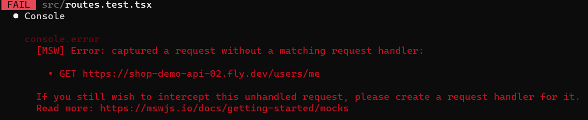
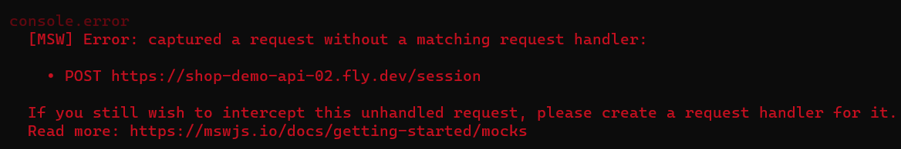

# 로그인

로그인 페이지를 만들고

LoginForm 컴포넌트를 만든다.

__로그인 페이지 input value값 스토어에서 관리하기__

./ui/TextBox 컴포넌트를 활용하여 id, pw 의 value 와 onChange를 다루고
이 값들은 LoginFormStore 에서 관리한다.

`./ui/TextBox.tsx`

```tsx
const handleChange = (event: React.ChangeEvent<HTMLInputElement>) => {
    onChange(event.target.value);
  };
```

`LoginForm.tsx`

```tsx
  // 스토어 사용할 수 있는 hooks로 스토어 접근
  const [{ email }, store] = useSignupFormStore();

  // input value값 바뀔때마다 store에 저장
  const handleChangeEmail = (value: string) => {
    store.changeEmail(value);
  };

...

<TextBox
  label="E-mail"
  placeholder="tester@example.com"
  value={email}
  onChange={handleChangeEmail}
/>
```

`LoginFormStore.ts`

```ts
  // email value 값 바뀔때마다 스토어에 저장할 수 있게 Action으로 선언
  @Action()
  changeEmail(email: string) {
    this.email = email;
  }
```

컴포넌트에서 useState로 관리하지 않고 스토어로 빼줬다.

---

## localStorage 활용하기

### 언제 어디서 localStorage에 로그인 토큰 값을 넣는지?

localStorage를 활용하여 새로고침시 유지, 전역적으로 동기화 할 수 있게 하자.

로그인 토큰을 localStorage에 넣을 것이다.

___usehooks-ts___ 를 사용한다.

로그인 토큰 관리하는걸 감추기 위해 hooks로 만든다.

`useAccessToken.ts`

-> 로그인 토큰이 필요한 컴포넌트에서 불러다가 사용할 예정이다.

```ts
export default function useAccessToken() {
  // usehooks-ts 로 이렇게 사용한다. 처음에는 빈 값으로 초기화
  const [accessToken, setAccessToken] = useLocalStorage('accessToken', '');

  // return 값으로 accessToken value값과
  // accessToken을 설정할 수 있는 setAccessToken 함수를 넘겨준다. (로그인 성공시 활용함)
  return { accessToken, setAccessToken };
}
```

`apiService.ts`

로그인 API를 호출하고 응답으로 토큰이 오면 accessToken으로 리턴한다.

```ts
async login({ email, password }: {
  email: string;
  password: string;
}): Promise<string> {
  const { data } = await this.instance.post('/session', { email, password });
  const { accessToken } = data;
  return accessToken;
}
```

`LoginFormStore.ts`

```ts
@singleton()
@Store()
export default class LoginFormStore {
  email = '';

  password = '';

  error = false;

  accessToken = '';

  // 로그인 성공시 호출될 Action - 스토어에 accessToken 을 저장
  @Action()
  setAccessToken(accessToken: string) {
    this.accessToken = accessToken;
  }

  // 로그인 실패시 호출될 Action
  @Action()
  setError() {
    this.error = true;
  }

  async login() {
    try {
      const accessToken = await apiService.login({
        email: this.email,
        password: this.password,
      });

      this.setAccessToken(accessToken);
      /*
      여기서 응답받은 localStorage에 바로 넣는게 아니라 해당 스토어에 값을 저장한다. 
      이 저장한 값을 LoginForm.tsx 에서 localStorage 에 넣어주는 작업이 필요하다.
      */
    } catch (e) {
      this.setError();
    }
  }
}
```

`LoginForm.tsx` 에서 스토어의 로그인 함수 호출

```tsx
 const handleSubmit = (event: React.FormEvent<HTMLFormElement>) => {
    event.preventDefault();
    store.login();
  };
```

`LoginForm.tsx`

useAccessToken hooks의 setAccessToken 기능을 가져옴.

스토어의 로그인 함수 호출

```tsx
  const { setAccessToken } = useAccessToken();

  // 1. 스토어에서 API를 통해 응답 받은 accessToken를 가져옴
  const [{ accessToken }] = useLoginFormStore();

  // 2. accessToken 값이 변경 될 때마다 
  // hooks의 setAccessToken을 사용하여 localStorage 값을 업데이트한다.
  useEffect(() => {
    if (accessToken) {
      setAccessToken(accessToken);
    }
  }, [accessToken]);
```

---

## 로그인 토큰 활용하기

### localStorage에 저장된 로그인 토큰을 활용하여 로그인 여부에 따른 UI 처리하기

필요한 곳에서 `useAccessToken` hooks를 통해 accessToken 값을 불러와서 처리를 해주면 된다.

```tsx
// localStorage 에 저장된 accessToken 가져오기 - hooks 사용
const { accessToken } = useAccessToken();
```

Header 에서 로그인 여부에 따른 GNB 구성을 달리하거나

상품 상세 페이지에서 장바구니에 담으려면 로그인 하라는 문구를 띄울 수 있다.

```tsx
 return(
  <>
   { accessToken ? ( 
    <div>
      환영합니다!
    </div>
   ) : (
     <div>
      로그인 해주세요.
    </div>
   )
  </>
 )
```

---

## API 호출시 헤더에 AccessToken (로그인 토큰) 넣어서 보내기

- 회원임을 증명해야 하는 경우 사용한다.

내 정보, 장바구니 확인 (해당 회원이 뭘 담았는지) 등등...

로그아웃 시 (토큰 무효화 처리를 위해)

`ApiService.ts`

// TODO :: 이 부분 다시 보자. 잘 이해 안감.

```ts
private accessToken = '';

setAccessToken(accessToken: string) {
  if (accessToken === this.accessToken) {
    return;
  }

  const authorization = accessToken ? `Bearer ${accessToken}` : undefined;

  // API 요청시 헤더에 토큰 값이 들어가게 한다.
  this.instance = axios.create({
    baseURL: API_BASE_URL,
    headers: { Authorization: authorization },
  });

  this.accessToken = accessToken;
}
```

`useAccessToken.ts`

```ts
export default function useAccessToken() {
  const [accessToken, setAccessToken] = useLocalStorage('accessToken', '');

  // localStorage의 accessToken이 변경될 때 마다 
  // ApiService 에서 선언한 메서드를 호출하여 API에 들어갈 로그인 토큰을 업데이트 해준다.
  useEffect(() => {
    apiService.setAccessToken(accessToken);
  }, [accessToken]);

  return { accessToken, setAccessToken };
}
```

---

이렇게 작업을 하면서 테스트를 돌리다가

`routes.test.tsx` 에서 에러가 발생했다.




에러 메시지를 읽어보니 handelers 에서 정의해주지 않았다고 나와서

`src/mocks/handlers.ts` 에서

```ts
  rest.post(`${BASE_URL}/session`, (req, res, ctx) => (
    res(ctx.json({ accessToken: 'ACCESS-TOKEN' }))
  )),

  rest.get(`${BASE_URL}/users/me`, (req, res, ctx) => (
    res(ctx.json({ id: '0BV000USR0001', name: 'tester' }))
  )),
```

이 두 개를 추가했다.

---

테스트에서 ReferenceError: Request is not defined 오류

setupTest.ts파일에 import 'whatwg-fetch' 추가하면 된다.

---

### 🌟 내가 프로젝트에서 개발할 때랑 다르게 새롭게 알게 된 부분

#### 1. TextBox 컴포넌트를 활용

- id, pw 의 value 와 onChange를 컴포넌트에서 처리함
- 이 값들은 스토어에서 관리

프로젝트를 진행할때는 useInput을 만들어서 value, onChange, setState 를 관리할 수 있게 했다. 그리고 각각의 상태값을 컴포넌트에서 직접 관리했는데 강의에서는 스토어에서 관리하는 버전을 배울 수 있었다.

이렇게 하니 컴포넌트에서 신경 써야 할 useState (상태 값)이 거의 없어졌다.

#### 2. onSubmit - Action으로 스토어에서 관리

로그인을 하는 상황에서

개인 프로젝트에서는 로그인 API 연결 hook을 불러온 뒤 mutate 로 API 요청했다.

로그인 요청 시 onSubmit 으로 컴포넌트에 있는 id, pw의 상태값을 받아서 onClick 이벤트가 있을 시에 요청했다.

강의에서는 onSumbit 상황에서 store.login() Action을 실행하게 한다.

해당 Action에는 스토어에 있는 id, pw값을 받아서 API 요청하게 작성한다.

#### 3. localStorage 관리 - hook으로 따로 빼기

프로젝트에서는 localStorage 를 등록하는 hooks를 만들어서

로그인 토큰을 받아오면 'token' 이란 이름으로 저장했다.

시간을 지정해놓고 저장해서 일정 시간 이후에 자동으로 삭제되게 하거나 로그아웃 시에 remove localStorage로 직접 삭제 처리했다.

강의에서는 `usehooks-ts`를 사용하여 setAccessToken 기능을 활용할 수 있었다. (기능을 감추기 위해서 hooks로 따로 빼서 정의함)

localStorage 값 - 등록, 수정이 가능하고 필요한 곳에서 값을 부를 수 있다.

플젝때는 수정할 수 있는 기능은 따로 없었는데 이 부분은 새롭게 배울 수 있었다.

#### 4. API 응답으로 받은 로그인 토큰 localStorage 에 저장하는 시점

프로젝트

- react-query를 사용하고 있어서 login 요청이 성공한 경우 onSuccess 함수에서 localStorage set hooks를 이용하여 설정함

강의

- 스토어에서 로그인 API 요청
- 요청 성공시 스토어에 token 값 저장
- 로그인 컴포넌트에서 스토어의 accessToken 값이 변경 될 때마다
- localStorage hooks의 setAccessToken을 사용하여 localStorage 값을 업데이트한다.

#### 5. API 호출시 헤더에 AccessToken (로그인 토큰) 넣어서 보내기

프로젝트

- 컴포넌트에서 localStorage hooks를 이용하여 로그인 토큰 값을 가져옴
- API 요청시 해당 토큰 값을 포함하여 전달 (함수 인자값으로 전달)
- 인자값으로 받은 걸 헤더에 대입

강의

- 모든 API를 관리하는 곳에서 로그인 토큰을 넣어서 기본 헤더를 세팅하고 API를 요청할 수 있게함
