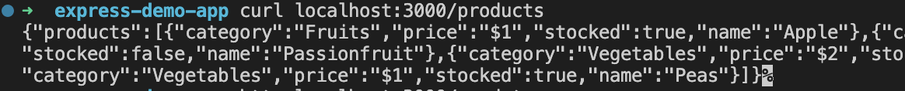
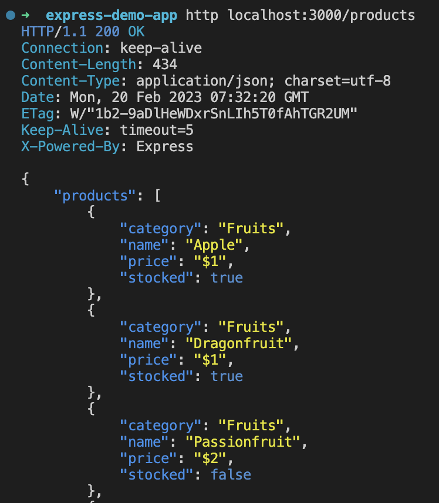

# Express

[학습 목표]

- Express 란
- URL 구조
- REST API
- HTTP Method(CRUD)

---

## Express 란?

유명한 node js의 프레임 워크

백엔드 영역이지만 공부가 필요! 백엔드에 대한 이해 없이 프론트만 작업하는건 불가능!

이 부분에 대해서 이해해보자.

node js를 사용한다고 하면 express는 기본으로 사용한다고 봐야할듯

ts 쓸거라서 강의노트에 몇가지 더 추가함

---

## node js에서 express를 사용하기 위한 사전 작업

### npm 패키지 세팅

작업 폴더 생성하고 .gitignore 파일에 node_modules 만 추가해주자.

```bash
mkdir express-demo-app
cd express-demo-app

touch .gitignore
echo "/node_modules/" > .gitignore
```

### 패키지 초기화

```bash
npm init -y
```

### TypeScript 개발환경에 설치

```bash
npm i -D typescript
npx tsc --init
```

### ESLint 개발환경에 설치

```bash
npm i -D eslint
npx eslint --init
```

원래 백엔드 express에서는 보통 require 를 많이 사용하는데,

이 프로젝트에서는 typescript 사용할거라 import export 사용해도 딱히 상관없음

```.
? Which framework does your project use? …
  React
  Vue.js
❯ None of these

// Browser 말고 Node 로 선택해준다.
? Where does your code run? …  (Press <space> to select, <a> to toggle all, <i> to invert selection)
  Browser
✔ Node

? What format do you want your config file to be in? …
❯ JavaScript
  YAML
  JSON

```

### ts-node 설치

```bash
npm i -D ts-node
```

typescript 사용할거라서 설치해준다.

그냥 쓰면 node를 설치하게 되어서 typescript 사용하면 한번 컴파일을 해줘야 함.

그런 불편함을 방지하기 위해 ts-node로 설치한다.

그리고 nodemon가 ts-node에 의존성이 있어서 설치를 해줘야함.

### Express 설치

```bash
npm i express
npm i -D @types/express
```

### nodemon 설치

코드를 수정할 때마다 서버를 재실행해야 하는 문제를 피하기 위해 nodemon 사용.

```bash
npm i -D nodemon
```

실행은 이렇게

```bash
npx nodemon app.ts
```

package.json에 명령어로 작성해주면 편리하게 사용 가능

```json
  "scripts": {
    "start": "npx nodemon app.ts"
  },
```

```bash
npm start
```

이 명령어로 서버 실행이 가능하다.

nodemon으로 돌고 있기 때문에 코드 수정 - 파일 저장 - 웹 페이지 새로고침

이렇게 하면 서버를 껐다 켰다 할 필요없이 수정된 코드가 반영 된 것을 확인할 수 있다.

-> 이거는 개발환경에서만!! 실서버 혹은 실 서버 코드에 직접 반영하는건 하지 않는다.

---

#### 간단한 예제 실습

```js
import express from 'express';

const port = 3000;

const app = express();

app.get('/', (req, res) => {
 res.send('Hello, world!');
});

app.listen(port, () => {
 console.log(`Server running at http://localhost:${port}`);
});

```

```bash
npm start
```

__URL 구조__

서버 실행 하고 localhost:3000으로 접속하면 Hello, world가 뜨는 것을 확인 할 수 있다.

```js
app.get('/')
```

'/'

=> <http://localhost:3000/>

를 의미한다.

</br>

'/posts'

=> <http://localhost:3000/posts>

를 의미한다.

브라우저에서 curl 요청을 한거라서 응답을 브라우저에서 받았다고 생각하면 된다.

bash 상에서 curl로 요청해도 같은 결과를 얻을 수 있다.

---

## REST API

간단한 REST API를 만들어보자.

REST하게 하려면 __필딩 제약 조건__ 이라는걸 지켜줘야 하는데

보통 그 중 Resource와 HTTP Verb만 도입하는 수준을 사용한다.

URL을 작성할 때의 예를 들자면...

❌ </br>
/write-post

URL에서 어떤 행위를 직접적으로 작성하지 않는다.

⭕️ </br>
/posts

대신 __어떤 리소스에 대해 명시__ 하고 __HTTP Method를 통해 어떤 동작이 일어날지 알려준다__.

### HTTP Method : (CRUD)

`Create : POST`

`Read : GET`

- Read는 Collection(복수)와 Item(Element)(단수)로 나뉜다.

`Update : PUT / PATCH`

- 예전에는 PUT을 많이 썼다. PUT은 해당 정보가 없을 때는 생성하고 있다면 이전 정보 전체를 덮어쓴다.
- 요새는 PATCH를 많이 쓴다. PATCH는 일부분만 수정한다. (http 스팩에 나중에 들어온 녀석)

`Delete : DELETE`

[상픔에 대한 URL을 작성해보자.]

Collection Pattern 활용
-> 이게 정확히 뭐지?

기본 리소스 URL: /products

#### 1. GET /products

- 상품 목록 확인
- Read (Collection)

#### 2. GET /products/{id}

- 특정 상품 정보 확인
- Read (Item)

#### 3. POST /products

- 상품 추가
- Create (Item)
- Collection Pattern 활용
- JSON 정보와 함꼐 전달.

```json
{
 "orderNum" : 1,
 "price" : 1000,
 "qty" : 2
}
```

이런식으로 같이 전달하면 DB에 해당 값 INSERT 한다.

#### 4. PUT or PATCH /produts/id

- 특정 상품 정보 변경
- Update (Item)
- JSON 정보와 함꼐 전달.

#### 5. DELETE /produts/id

- 특정 상품 삭제
- Delete (Item)

---

### GET /produts 를 작성해보자

상품의 전체 목록을 받을 수 있는 API 이다.

```js
app.get('/products', (req, res) => {

 const products = [
  {
   category: 'Fruits', price: '$1', stocked: true, name: 'Apple',
  },
  {
   category: 'Fruits', price: '$1', stocked: true, name: 'Dragonfruit',
  },
  {
   category: 'Fruits', price: '$2', stocked: false, name: 'Passionfruit',
  },
  {
   category: 'Vegetables', price: '$2', stocked: true, name: 'Spinach',
  },
  {
   category: 'Vegetables', price: '$4', stocked: false, name: 'Pumpkin',
  },
  {
   category: 'Vegetables', price: '$1', stocked: true, name: 'Peas',
  },
 ];

 res.send({ products });
});
```

res.send

respose 응답으로 produts JSON 형태의 데이터를 보내준다.

여기서 이 데이터를 보낼때 저 형태로 보내면 자동으로 JSON으로 처리되어 보내진다. 일부러 JSON.stringify 처리를 할 필요가 없다. 오히려 에러날 수 있으니 해당 형태로 보내자.

---

### [요청 - 응답]

API가 제대로 생성되었는지 curl 요청을 통해 확인해보자

```bash
curl localhost:3000/products
```



응답이 온다.

다듬어진 JSON 형태로 응답을 확인하고 싶다면

### httpie 설치

```bash
brew install httpie
```

요청

```bash
http localhost:3000/products
```



