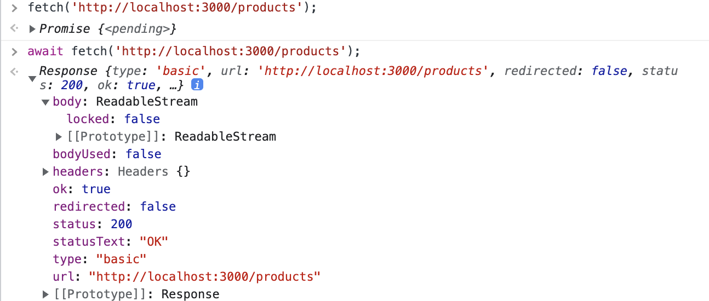
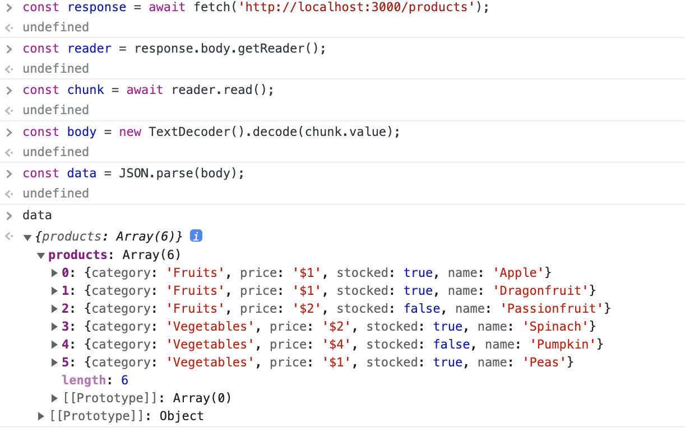
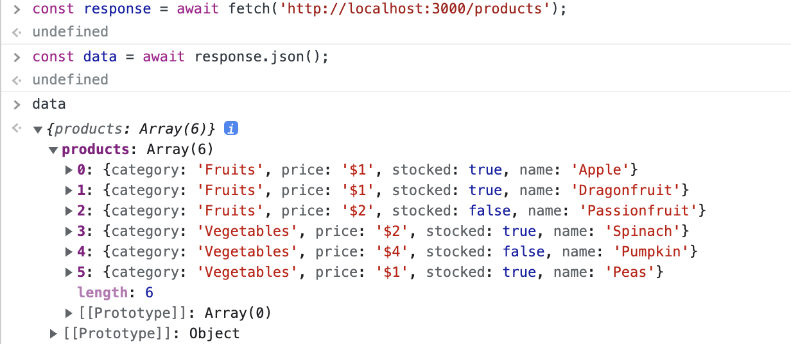
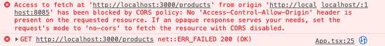

# Fetch API 와 CORS 정책

[학습 목표]

- Fetch API 란
- Promise
- ReableStream
- Unicode
- CORS 란

---

## Fetch API

웹 브라우저서 사용하는 것
fetch 라는 함수를 쓴다..

백엔드 서버를 열어놓고 브라우저에서 fetch를 기본적으로 체크해보자.

```string
fetch('http://localhost:3000/products');
// → Promise

await fetch('http://localhost:3000/products');
// → Response
```



요청을 하고 응답을 받아서 확인해보니

그냥 fetch로 요청할때는 Promise 가 뜨고

앞에 await를 붙여서 요청하니 Response가 오는 것을 확인할 수 있다.

그런데 여기의 Response의 body에는 값이 나오지 않고 ReadableStream으로만 나오고 있어서 이 안에 있는 값들을 확인하기 위해 getReader 를 사용해보자.

chunk 과정을 통해 값을 가져온다.



chunk.value는 Uint8Array 타입.

원래는 chunk.done이 true일 때까지 반복해야 한다.

매번 이렇게 할 수 는 없음...

그래서 기본 지원하는 JSON - response.json 기능을 사용한다.



GET 이외에 다른 메서드들을 사용해보고 싶다면

```js
const response = fetch(url, {
 method: 'POST',
});
```

이런식으로 작성한다.

---

### CORS

웹 브라우저는 Same Origin Policy에 따라 웹 페이지와 리소스를 요청한 곳이 서로 다른 출처(포트까지 포함)일 때 서버에서 얻은 결과를 사용할 수 없게 막는다.

웹 브라우저의 Same Origin Policy

CORS ERROR



- 웹 페이지(프론트-요청)와 리소스를 요청한 곳(백엔드-REST API 서버)가 서로 다른 출처이면 서버에서 얻은 결과를 사용할 수 없게 막는다. (port 까지 다 따짐)

서버에 요청하고 응답을 받아오는 것까지는 다 된건데 브라우저 단에서 막는 것.

해결 방법

- 리소스를 주는 서버에서 알려준다.
- "여기에서 요청했다면 괜찮아." <- 이거를 설정해줘야함
- 백엔드에서 설정해주는 것

Express에서 CORS 미들웨어를 설치해서 사용한다.

```bash
npm i cors
npm i -D @types/cors
```

CORS 미들웨어 사용

```js
import express from 'express';
import cors from 'cors';

const app = express();

app.use(cors());
```

이렇게 설정해주면 프론트에서 다시 요청할때 cors 에러가 해결 된 것을 확인 할 수 있다.

---

### 프론트에서는 어떻게 받아오는가??

```tsx
import ReactDOM from 'react-dom/client';

import App from './App';

async function main() {
  const url = 'http://localhost:3000/products'
  const response = await fetch(url);

  const data = await response.json();

  const { products } = data;

  const element = document.getElementById('root');

  if (!element) return;

  const root = ReactDOM.createRoot(element);
  root.render(<App products={products} />);
}

main();

```

App.tsx 자체에서 async await를 사용하려다가

`Objects are not valid as a React child (found: [object Promise])`

이러한 에러가 났었다.

함수형 컴포넌트는 async로 실행될 수 없기 때문...

함수형 컴포넌트에서 비동기 통신을 하려면 useEffect를 사용해야 한다고 함.

main.tsx 에서 fetch 하는걸로 수정했다.

[참고 블로그]('https://velog.io/@lire_eruel/Objects-are-not-valid-as-a-React-child-found-object-Promise-%EC%97%90%EB%9F%AC-%EC%9B%90%EC%9D%B8-%EB%B0%8F-%ED%95%B4%EA%B2%B0')
