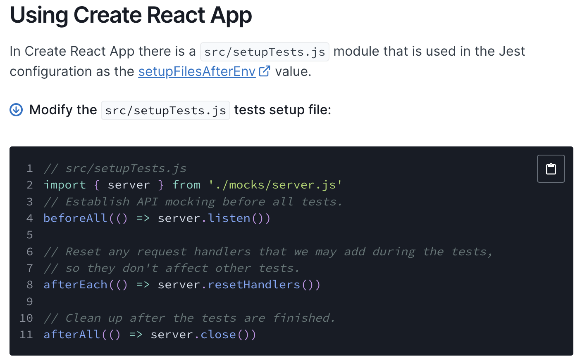

# MSW

## 학습 키워드

- Service worker
- MSW(Mock Service Worker)
- polyfill(폴리필)

---

코드 레벨이 아니라 proxy를 이용해서 네트워크 레벨에서 가짜로 구현한다.

설치

```bash
npm i -D msw
```

msw를 이용해 서버를 띄우고 하나하나 끝날때마다 초기화 해주고 전부 끝나면 초기화 해주는..



[node - msw setting](https://mswjs.io/docs/getting-started/integrate/node)

이거를 `jest.config.js`에서 추가해준다.

“setupFilesAfterEnv” 속성에 setupTests.ts 파일 추가.

```js
module.exports = {
 testEnvironment: 'jsdom',
 setupFilesAfterEnv: [
  '@testing-library/jest-dom/extend-expect',
  '<rootDir>/src/setupTests.ts',
 ],
 transform: {
  '^.+\\.(t|j)sx?$': ['@swc/jest', {
   jsc: {
    parser: {
     syntax: 'typescript',
     jsx: true,
     decorators: true,
    },
    transform: {
     react: {
      runtime: 'automatic',
     },
    },
   },
  }],
 },
};
```

`<rootDir>/src/setupTests.ts`

`<rootDir>`은 현재 프로젝트 폴더를 의미한다.

그 안에 src > setupTests.ts 에 명시하겠다는 것..

처음에 파일 없이 테스트 돌리면 파일 없다고 실패 뜸.

무슨 내용을 넣어줘야 하는가?

```ts
import server from './mocks/server';

beforeAll(() => server.listen({ onUnhandledRequest: 'error' }));

afterAll(() => server.close());

afterEach(() => server.resetHandlers());
```

```js
onUnhandledRequest: 'error'
```

이거는 뭐냐면... 깜빡하고 핸들러 함수에 내용을 안만들었을 때 에러나게끔 하는 것.

암튼 내용을 넣어주고 나면

```ts
import server from './mocks/server';
```

이게 없다고 함...

```touch
mkdir src/mocks

touch src/mocks/server.ts
```

만들어준다.

`src/mocks/server.ts`

```ts
/* eslint-disable import/no-extraneous-dependencies */

import { setupServer } from 'msw/node';

import handlers from './handlers';

const server = setupServer(...handlers);

export default server;

```

`src/mocks/handlers.ts`

```ts
/* eslint-disable import/no-extraneous-dependencies */
import { rest } from 'msw';

const BASE_URL = 'http://localhost:3000'

const handlers = [
  rest.get(`${BASE_URL}/products`, (req, res, ctx) => {
    const products = [
      {
        category: 'Fruits', price: '$1', stocked: true, name: 'Apple',
      },
    ];

    return res(
      ctx.status(200),
      ctx.json({ products }),
    );
  }),

];

export default handlers;

```

`App.test.tsx`

데이터 받아오기 전에 빈값으로 렌더링 되는데 이걸 체크하기 때문에 실패 뜸.

그래서 기다려 주는 부분을 추가해준다.

```tsx
import { render, screen, waitFor } from '@testing-library/react';
import App from './App';

test('App', () => {
  render(<App />);

  waitFor(() => {
    screen.getByText('Apple');
  });
});

```

`waitFor` 은 이 안에 있는게 될 때 까지 확인해줌

잘 되고 있는지 확인해보려고 getByText('Apple!!') 로 바꿨는데 뭐임?? 왜 통과되지?

`waitFor`을 들어가서 보면 이게 Promise로 되어 있음. 그래서 async await 로 처리해줘야 함.

```ts
export function waitFor<T>(
  callback: () => Promise<T> | T,
  options?: waitForOptions,
): Promise<T>
```

```tsx
import { render, screen, waitFor } from '@testing-library/react';
import App from './App';

// 이제는 jest.mock() 불필요

test('App', async () => {
  render(<App />);

  await waitFor(() => {
    screen.getByText('Apple!!!!');
  });
});
```

그럼 이제 정상적으로 실패가 뜬다...

---

엥?? 근데 에러뜸...

```.
ReferenceError: fetch is not defined
```

최신 node에는 fetch 가 반영 되어 있는데 우리는 없음.

- [GitHub에서 만든 fetch polyfill](https://github.com/github/fetch)

여기서 보고 개발용으로 설치해준다.

```bash
npm i -D whatwg-fetch
```

그렇게 하고 setupTest.ts 에 이 부분을 추가해준다.

```ts
/* eslint-disable import/no-extraneous-dependencies */
import 'whatwg-fetch';
```

---
