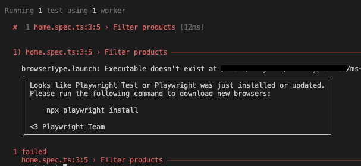

# Playwright

## 학습 키워드

- E2E(End to End) Test
- Headless Chrome
- Puppeteer
- Playwright
- CodeceptJS

---

앞에서는 진짜 같은 걸로... 테스트 해줬는데

진짜로!!! 테스트를 해줘야함.

---

웹브라우저 기반의 E2E 테스트 자동화 도구

다양한 웹브라우저를 지원한다.

우리는 크롬을 사용할 예정..

브라우저에서 직접 테스트해주는 것..

headless 브라우저 - 직접 화면 안띄우고 뒤에서 돌릴 수도 있음

테스트를 지원함...

---

### 설치

```bash
npm i -D @playwright/test eslint-plugin-playwright
```

우리는 테스트를 할 것이라서 이렇게 설치함..

개발환경에서만 사용하면 된다.

그리고 백엔드 서버가 실제로 돌아가고 있어야함.

설치를 하고 config 파일을 만들어준다.

```bash
touch playwright.config.ts
```

```ts
/* eslint-disable import/no-extraneous-dependencies */
import { PlaywrightTestConfig } from '@playwright/test';

const config: PlaywrightTestConfig = {
  testDir: './tests', // 테스트는 여기에 있어
  retries: 0,
  use: {
    baseURL: 'http://localhost:8080',
    headless: !!process.env.CI, // CI 환경이 잡혀 있으면 headless로 한다.
    screenshot: 'only-on-failure',
  },
};

export default config;
```

### 환경 세팅

테스트 하는 것들 모아두는 폴더 생성

```bash
mkdir tests

touch tests/.eslintrc.js
```

`tests/.eslintrc.js`

```js
module.exports = {
  env: {
    jest: false, // jest는 사용하지 않을거임
  },
  extends: ['plugin:playwright/playwright-test'],
  rules: {
    'import/no-extraneous-dependencies': 'off',
  },
};
```

### 실행

```bash
npx playwright test

CI=true npx playwright test
```

#### CI=true를 붙이면 headless 환경에서 실행됨. 브라우저 안띄우고 뒤에서 돌아감.

---

### 실습

예제 하나 생성해보자.

```bash
touch tests/home.spec.ts
```

`tests/home.spec.ts`

```ts
import { test, expect } from '@playwright/test';

test('Filter products', async ({ page }) => {
  await page.goto('/');

  await expect(page.getByText('Apple')).toBeVisible(); // 됨
  await expect(page.getByText('Grape')).toBeHidden(); // 됨
  await expect(page.getByText('Grape')).toBeVisible(); // 안됨
});
```

간단한 예제를 작성해서 돌려보자

```bash
npx playwright test
```



띠용.. 크롬 관련 설정이 안되어 있다는 오류가 뜬다.

`playwright.config.ts`

```js
/* eslint-disable import/no-extraneous-dependencies */
import { PlaywrightTestConfig } from '@playwright/test';

const config: PlaywrightTestConfig = {
  testDir: './tests', // 테스트는 여기에 있어
  retries: 0,
  use: {
    channel: 'chrome',
    baseURL: 'http://localhost:8080',
    headless: !!process.env.CI, // CI 환경이 잡혀 있으면 headless로 한다.
    screenshot: 'only-on-failure',
  },
};

export default config;
```

use 에 channel 을 명시함

이렇게 하면 다시 테스트 하면 잘 된다.

실패하는 테스트가 있다면? 될때까지 try 해보고 타임아웃 된다.

---

### 검색어가 잘 작동하는지 테스트

```ts
import { test, expect } from '@playwright/test';

test('Filter products', async ({ page }) => {
  await page.goto('/');

 // 'Search' input을 찾음 -> getByLabel 을 사용하면 input을 찾음
  const searchInput = page.getByLabel('Search');

 // input 에 'a'를 입력함
  await searchInput.fill('a');

 // 'Apple' 이 화면에 보임 = 'Apple'이 검색됨
  await expect(page.getByText('Apple')).toBeVisible();

 // input 에 'aa'를 입력함
  await searchInput.fill('aa');

 // 'Apple' 이 화면에 안 보임 = 'Apple'이 검색되지 않음
  await expect(page.getByText('Apple')).toBeHidden();
});
```

---

### counter 가 잘 작동하는지 테스트

- 직접 증가 시키기

```ts
test('Click the “+” button', async ({ page }) => {
  await page.goto('/');

  await page.getByText('+').click();
  await page.getByText('+').click();
  await page.getByText('+').click();

  await expect(page.getByText('3')).toBeVisible();
});
```

'+' 버튼을 3번 누르면 '3'이 화면에 나올것...

통과됨.

</br>

- count 변수를 이용하기

```ts
test('Click the “+” button using "count"', async ({ page }) => {
  await page.goto('/');

  const count = 13;

  await Promise.all((
    [...Array(count)].map(async () => {
      await page.getByText('+').click();
    })
  ));

  await expect(page.getByText(`${count}`)).toBeVisible();
});
```

```ts
await page.getByText('+').click();
```

- 이것들이 다 await 를 사용하기 때문에 `await Promise.all` 을 사용한다.

얘네들 전부다 됐을때 다음으로 넘어갈 수 있도록함.

Promise 가 리턴을 해줘야 하기 때문에 forEach 말고 map으로 써준다.

성공함

---

에러가 나면 test-results 폴더에 캡쳐가 남는다.

이거는 `.gitignore`에 적어서 제외해주자.

`.gitignore`

```.
/test-results/
```

---

playwright 는 아주 섬세한걸 처리할때 유용하다. (복잡한걸 처리할때는 이걸 사용)

이거보다 단순하고 사람들이 읽기 좋은 코드로 쓸 수 있는건 `CodeceptJs`이다.

- 아샬님은 이걸 많이 쓴다고 함

### CodeceptJs

- [CodeceptJS](https://codecept.io/)
- [CodeceptJS 3 시작하기](https://github.com/ahastudio/til/blob/main/test/20201207-codeceptjs.md)
- [CodeceptJS 사용](https://github.com/ahastudio/CodingLife/tree/main/20211012/react#codeceptjs-사용)

```js
Scenario('check Welcome page on site', ({ I }) => {
  I.amOnPage('/');
  I.see('Welcome');
});
```

이런느낌이다.

---

테스트 하는 방법을 봤다.

- 기본이 되는 Jest 라는 도구를 이용해서 테스트 할 수 있고

- 단위 테스트 하는방법

- 가능하면 테스트를 먼저 쓰고 코드를 작성하는 TDD 방식을 활용하고

- React test
  - UI는 자주 바뀌기 때문에 비지니스 로직을 분리해야 한다. (관심사의 분리)
  - 빡빡한 UI 테스트는... 범용성이 있는 애들을 위주로 한다. (useInput 같은...)
  - 나머지 부분들은 모킹을 하던지 msw를 써서 하던지... (백엔드 API 가 없을 때)

- Playwright / CodeceptJs(코드가 좀 더 잘 읽힘)
  - 확실하게 돌아가는걸 확인

도구를 많이 알아놓으면 좋음.

개발할때는 Playwright 쓰고 기획 / PO 랑 소통할때는 CodeceptJs를 쓰고... 이런식으로?