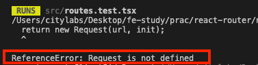

# Navigation

__학습 키워드__

- Web APIs - History
- React Router - NavLink, Link, Navigate, useNavigate

---

## Web APIs - History

무엇인지?
> 페이지를 이동할때마다 새로 로딩 되는 부분

왜 생겼는지?

>원래는 이거를 컨트롤 하지는 못함. 웹브라우저가 알아서 하는 부분,
>
>그런데 html5 부터는 History.pushState() 라는 API가 생김
>
>이거 전에는 주소에 # 붙여서 이동하면 새로 로딩하지 않는 그런.. 것을 사용했다. 또는 #! 붙여서 했었다.

---

### window.history.pushState

이거 외에 링크 자체를 가로채서 이동하지 않고 강제로 주소를 변경하는 방법이 있다.

```tsx
import { SyntheticEvent } from 'react';

export default function Header() {

  const handleClick = (event: SyntheticEvent) => {
    event.preventDefault();
    const state = {};
    const title = '';
    const url = '/about';
    window.history.pushState(state, title, url);
  };

  return (
    <header>
      <nav>
        <ul>
          <li>
            <a href="/" onClick={handleClick}>Home</a>
          </li>
          <li>
            <a href="/about" onClick={handleClick}>About</a>
          </li>
        </ul>
      </nav>
    </header>
  );
}
```

window.history.pushState 를 사용하면 강제로 링크가 변한다.

실제로 넘어가지는 않았는데 링크만 넘어간 것을 확인 할 수 있다.

---

### React Router - `Link`

우리는 react-router에서 제공하는 `Link` 를 사용한다.

주소도 바뀌고 안에 내용도 바꿔주는 그런 역할을 다 한다.

```tsx
import { Link } from 'react-router-dom';

export default function Header() {
  return (
    <header>
      <nav>
        <ul>
          <li>
            <Link to="/">Home</Link>
          </li>
          <li>
            <Link to="/about">About</Link>
          </li>
        </ul>
      </nav>
    </header>
  );
}
```

컴포넌트를 이미 다 불러왔음 다시 다른 페이지로 넘어가지만 아무것도 로딩하지 않음.

---

### React Router - `NavLink`

현재 위치 : 현재 링크가 무엇인지 `class="active"` 로 알려줌

```tsx
import { Link, NavLink } from 'react-router-dom';

export default function Header() {
  return (
    <header>
      <nav>
        <ul>
          <li>
            <NavLink to="/">Home</NavLink>
          </li>
          <li>
            <NavLink to="/about">About</NavLink>
          </li>
        </ul>
      </nav>
    </header>
  );
}
```

그러면 .active에 특정 css를 적용해서 현재 링크가 어디인지 확인 할 수 있음

---

### React Router - Navigate

이건 무조건 리다이렉션 해주는것.

`Header.tsx`

```tsx
import { Link } from 'react-router-dom';

export default function Header() {
  return (
    <header>
      <nav>
        <ul>
          <li>
            <Link to="/">Home</Link>
          </li>
          <li>
            <Link to="/about">About</Link>
          </li>
          <li>
            <Link to="/logout">Logout</Link>
          </li>
        </ul>
      </nav>
    </header>
  );
}
```

로그아웃 부분을 추가했다.

이후 '/logout'으로 이동하면 처리를 해줘야하기 때문에

`routes.ts`

```ts
import Layout from './components/Layout';

import HomePage from './pages/HomePage';
import AboutPage from './pages/AboutPage';
import LogoutPage from './pages/LogoutPage';

const routes = [
  {
    element: <Layout />,
    children: [
      { path: '/', element: <HomePage /> },
      { path: '/about', element: <AboutPage /> },
      { path: '/logout', element: <LogoutPage /> },
    ],
  },

];

export default routes;
```

routes 에서 페이지를 지정해준다.

`Logout.tsx`

```tsx
import { Navigate } from 'react-router-dom';

export default function LogoutPage() {
  // 뭔가 로그아웃 처리를 하고
  return (
    <Navigate to="/" />
  );
}
```

여기서 `Navigate` 를 사용한다. 냅다 '/'로 리다이렉트 시켜줌.

그러면 여기서 테스트 코드는 어떻게 짜야할까??

`routes.test.ts`

```ts
describe('App', () => {
  function renderRouter(path: string) {
    const router = createMemoryRouter(routes, { initialEntries: [path] });

    render(<RouterProvider router={router} />);
  }
  ...

  context('when the current path is "/logout"', () => {
    it('renders the logout page', () => {
      renderRouter('/logout');

      screen.getByText(/Welcome/); // '/'로 바로 리다이렉트 되기 때문
    });
  });
});
```

이렇게 작성할 수 있다.

그런데 테스트에서 “ReferenceError: Request is not defined” 이런 에러가 난다.



->“whatwg-fetch”를 임포트해서 해결할 수 있다.

```bash
npm i -D whatwg-fetch
```

테스트가 시작하는 파일에 임포트..

`jest.config.js`

```.
setupFilesAfterEnv: [
  '@testing-library/jest-dom/extend-expect',
  '<rootDir>/src/setupTests.ts',
 ],
```

이거 설정해줬는지 확인하고

`setupTests.js`

```js
/* eslint-disable import/no-extraneous-dependencies */
import 'whatwg-fetch';
```

이렇게 해준다.

그러면 테스트 통과..!

---

### React Router - useNavigate

이거를 더 많이 쓰긴 함..

hook으로 얻을 수 있음. 내가 직접 컨트롤 해준다.

logout 버튼 눌렀을때만 이동하게 처리함.

```tsx
import { Link, useNavigate } from 'react-router-dom';

export default function Header() {
  const navigate = useNavigate();

  const handleClickLogout = () => {
    navigate('/');
  };

  return (
    <header>
      <nav>
        <ul>
          <li>
            <Link to="/">Home</Link>
          </li>
          <li>
            <Link to="/about">About</Link>
          </li>
          <li>
            <button type="button" onClick={handleClickLogout}>logout</button>
          </li>
        </ul>
      </nav>
    </header>
  );
}
```