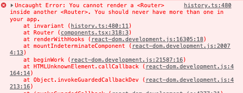

# Router

__학습 키워드__

- ReactRouter - RouterProvider

---

React Router 버전 6.4부터 지원하는 라우터 객체를 만들어서 쓰는 방법이다.

라우팅 정보만 별도의 파일로 관리함

현재 App 이 전체 레이아웃 구조, 라우팅을 잡고 있다.

이걸 나눠준다.

라우팅 처리하는거는 object로 만들어서 처리해주고

레이아웃도 따로 빼준다.

---

## RouterProvider 사용하기

이걸 사용해서 라우팅 해보자

```tsx
import {
  createBrowserRouter, RouterProvider,
} from 'react-router-dom';

import AboutPage from './pages/AboutPage';
import HomePage from './pages/HomePage';

const routes = [
  { path: '/', element: <HomePage /> },
  { path: '/about', element: <AboutPage /> },
];

const router = createBrowserRouter(routes);

export default function App() {
  return (
    <RouterProvider router={router} />
  );
}

```

routes 라는걸 이용해서 브라우저 객체를 통으로 만들어 줄 수 있다.
createBrowserRouter를 이용한다.
분기를 하는시점이 어딘지 모르기때문에 레이아웃을 잡아준다.



이전에 main.tsx에서 브라우저 라우팅 처리해준 부분이 있어서 두번이나 썼다고 에러메시지를 뱉는것이다.

`main.tsx에서 브라우저 라우팅 처리한 부분을 제외한다.`

---

### `routes` 를 계층형으로 사용해서 Layout 적용하기

`App.tsx`

```tsx
import { createBrowserRouter, RouterProvider } from 'react-router-dom';

import routes from './routes';

const router = createBrowserRouter(routes);

export default function App() {
  return (
    <RouterProvider router={router} />
  );
}
```

`routes.ts`

```ts
import Layout from './components/Layout';

import AboutPage from './pages/AboutPage';
import HomePage from './pages/HomePage';

const routes = [
  {
    element: <Layout />,
    children: [
      { path: '/', element: <HomePage /> },
      { path: '/about', element: <AboutPage /> },
    ],
  },
];

export default routes;
```

routes를 파일로 따로 빼는 이유?

테스트에서도 이 정보를 사용하기 때문에 빼주는것이 좋다.

`Layout.tsx`

```tsx
import { Outlet } from 'react-router-dom';

import Footer from './Footer';
import Header from './Header';

export default function Layout() {
  return (
    <div>
      <Header />
      <main>
        <Outlet />
      </main>
      <Footer />
    </div>
  );
}
```

계층형으로 잡고 childeren에 뭔가를 넣어주자.

얘네들 그려지는건 전부다 `<Layout />` 으로 그려지고 Layout이 밑에 있는것들을 인지해서 쓸 수 있어야 한다.

그걸 지원해줘야 함.

children 부분은 react-router-dom 에서 `Outlet`으로 지원받을 수 있다.

---

이렇게 정리를 하고 나면 App에 대한 테스트를 하는것은 무의미하다.

아무역할도 안하고 있기 때문에...

그래서 App.test.ts -> `routes.test.ts`로 변경해준다.

```ts
import { render, screen } from '@testing-library/react';

import { createMemoryRouter, RouterProvider } from 'react-router-dom';

import routes from './routes';

const context = describe;

describe('App', () => {
  function renderRouter(path: string) {
    const router = createMemoryRouter(routes, { initialEntries: [path] });

    render(<RouterProvider router={router} />);
  }
  context('when the current path is "/"', () => {
    it('renders the home page', () => {
      renderRouter('/');

      screen.getByText(/Welcome/);
    });
  });

  context('when the current path is "/about"', () => {
    it('renders the about page', () => {
      renderRouter('/about');

      screen.getByText(/This is test/);
    });
  });
});
```

---

테스트 코드에서 작성한

`createMemoryRouter`와 `MemoryRouter`는 뭔 차이가 있는걸까??

1. MemoryRouter

지금 위치가 어딘지 알려줘야함.

```tsx
<MemoryRouter initialEntries={['/about']}>
  ...
</MemoryRouter>
```

현재 url을 알려주기 위해서 테스트 코드에 이렇게 작성했었다.

2. createMemoryRouter

```ts
const routes = [
  {
    element: <Layout />,
    children: [
      { path: '/', element: <HomePage /> },
      { path: '/about', element: <AboutPage /> },
    ],
  },
];

...

const router = createMemoryRouter(routes, { initialEntries: ['/'] });

render(<RouterProvider router={router} />);
```

주로 테스트에 사용됨... 브라우저가 아닌 환경에서도 React 라우터를 실행하는 데 사용할 수 있음.

아니 근데 뭔 차인지...

눈에 보이는 차이점은 routes 인데..

routes 는 브라우저 객체를 통으로 만들어 주는 녀석..

흠..ㅠㅠㅠ 이거 말고는 모르겠다...