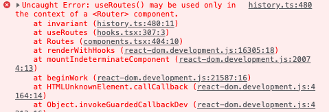

# Routes

__학습 키워드__

- 라우터란?
- React Router
  - Browser Router
  - Route
  - Memory Router

---

## 라우터란?

__React Router__
: 리액트 경로 이동을 위한 라이브러리

> [React Router](https://reactrouter.com/)

React 는 SPA(single page application)이다. 즉 페이지가 하나인 웹 어플리케이션이기 때문에 페이지 이동을 하지 않는다.

즉 html 파일이 하나라는 말과 같다. 경로에 따라 다르게 UI를 보여주고 싶다면 React Router 라이브러리로 경로 찾는 행위(라우팅)을 해줘야 한다.

---

## React Router로 실습하기

```bash
npm install react-router-dom
```

개발환경에서 뿐만 아니라 실제 배포 환경에서도 사용할 것이기 때문에 -D 없이 설치

`App.tsx`

```tsx
import { Route, Routes } from 'react-router-dom';

import Footer from './components/Footer';
import Header from './components/Header';

import AboutPage from './pages/AboutPage';
import HomePage from './pages/HomePage';

export default function App() {
  return (
    <div>
      <Header />
      <main>
        <Routes>
          <Route path="/" element={<HomePage />} />
          <Route path="/about" element={<AboutPage />} />
        </Routes>
      </main>
      <Footer />
    </div>
  );
}

```

설치하고 바로 사용이 가능한가?



이런 에러가 난다. 사용할 수 없다는 건데....

> Routes
>
> [Routes 문서](https://reactrouter.com/en/main/components/routes)

__브라우저에서 쓰고 있다는 것을 잡아줘야 함.__

`main.tsx` 에 와서 브라우저 라우터 환경을 세팅해준다.

```ts
import React from 'react';
import ReactDOM from 'react-dom/client';
import { BrowserRouter } from 'react-router-dom';

import App from './App';

function main() {
  const element = document.getElementById('root');

  if (!element) return;

  const root = ReactDOM.createRoot(element);

  root.render((
    <React.StrictMode>
      <BrowserRouter>
        <App />
      </BrowserRouter>
    </React.StrictMode>
  ));
}

main();
```

그렇다면 테스트 코드는 어떻게 작성해줄까??

`App.test.tsx`

```tsx
import { render, screen } from '@testing-library/react';

import { MemoryRouter } from 'react-router-dom';

import App from './App';

const context = describe;

describe('App', () => {
  context('when the current path is "/"', () => {
    it('renders the home page', () => {
      render((
        <MemoryRouter initialEntries={['/']}>
          <App />
        </MemoryRouter>
      ));

      screen.getByText(/Welcome/);
    });
  });

  context('when the current path is "/about"', () => {
    it('renders the about page', () => {
      render((
        <MemoryRouter initialEntries={['/about']}>
          <App />
        </MemoryRouter>
      ));

      screen.getByText(/This is test/);
    });
  });
});

```

지금 위치가 어딘지 알려줘야함.

```tsx
<MemoryRouter initialEntries={['/about']}>
  ...
</MemoryRouter>
```

테스트에서는 이렇게 알릴 수 있음.
