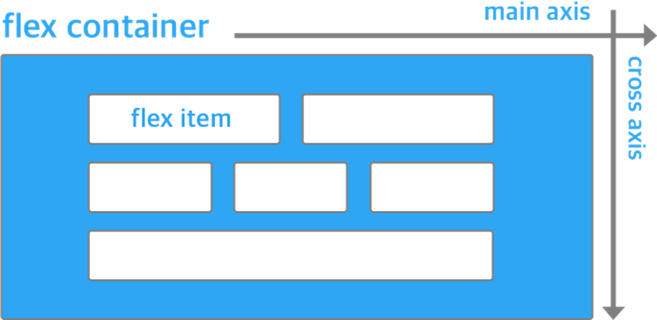
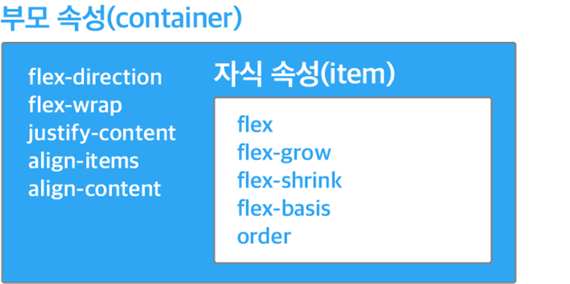

# CSS 파헤치기

선택자, 박스모델, media query, Flexbox, Grid

---

## 박스모델

모든 HTML 요소는 박스(box) 모양으로 구성되며 이것을 박스 모델 (box model)이라고 한다.

박스 모델은 HTML 요소를 패딩(padding), 테두리(border), 마진(margin), 그리고 내용(content)으로 구분한다.


1. 내용(content) : 텍스트나 이미지가 들어있는 박스의 실질적인 내용 부분

2. 패딩(padding) : 내용과 테두리 사이의 간격. 패딩은 눈에 보이지 않음

3. 테두리(border) : 내용와 패딩 주변을 감싸는 테두리

4. 마진(margin) : 테두리와 이웃하는 요소 사이의 간격입니다. 마진은 눈에 보이지 않음.

</br>

### box-sizing: border-box

- html 요소의 높이와 너비 구하기


기본적으로 이렇게 박스 요소의 넓이와 높이를 구할때는 컨텐츠, 마진, 패딩, 보더를 합해서 구한다.

이 상황에서 width 300px을 정확하게 맞춰야 한다면 컨텐츠, 마진, 패딩, 보더를 다 계산을 해줘야하는데 이건 너무 복잡하다.

그래서 `box-sizing: border-box`을 사용한다.

box-sizing 속성의 기본값은 content-box 인데,

위에서 설명드린 것 처럼 width 속성값은 순수하게 content 영역의 너비만을 포함한다.

하지만 box-sizing 속성값을 border-box로 변경해주면, width 속성값은 content 영역뿐만 아니라 padding과 border까지 포함시키게 된다.

</br>

참고 블로그

[박스모델](http://www.tcpschool.com/css/css_boxmodel_boxmodel)

[box-sizing](https://www.daleseo.com/css-box-model/)

---

## media query

미디어 쿼리를 사용하면 디바이스의 일반적인 유형 / 화면 해상도 / 브라우저 뷰포트 너비와 같은 기타 특성에 따라 CSS 스타일을 적용할 수 있다.

```css
@media (min-width: 800px) {
  .large-tomato {
    color: tomato;
  }
}
```

주로 반응형 웹을 만들때 사용한다. 

각 기기 별로 미디어쿼리 break point가 다르므로 참고하여 작성하면 된다.

### 일반적인 미디어 쿼리 break point

```css
// X-Small devices (portrait phones, less than 576px)

// Small devices (landscape phones, 576px and up)
@media (min-width: 576px) { ... }

// Medium devices (tablets, 768px and up)
@media (min-width: 768px) { ... }

// Large devices (desktops, 992px and up)
@media (min-width: 992px) { ... }

// X-Large devices (large desktops, 1200px and up)
@media (min-width: 1200px) { ... }

// XX-Large devices (larger desktops, 1400px and up)
@media (min-width: 1400px) { ... }
```

```bash
# Common screen sizes
Mobile: 360 x 640
Mobile: 375 x 667
Mobile: 360 x 720
iPhone X: 375 x 812
Pixel 2: 411 x 731
Tablet: 768 x 1024
Laptop: 1366 x 768
High-res laptop or desktop: 1920 x 1080
```

### 반응형 웹, 모바일 먼저? 데스크탑 먼저?

#### 1. 모바일우선 - min-width 사용 (최소 ~ 부터 적용)

작은 가로폭부터 큰 가로폭 순서로 만드는 것

※ 모바일 = 작다 = min, 모바일기기는 해상도가 작기 때문에 작은게 먼저 조건에 부합

</br>

#### 2. 데스트탑우선 - max-width 사용 (최대 ~ 까지 적용)

큰 가로폭부터 작은 가로폭 순서로 만드는 것

※ desktop = 크다 = max, 데스크탑은 해상도가 크기 때문에 큰게 먼저 조건에 부합

</br>

details...

[참고블로그](https://log.designichthus.com/11)

---

## Flexbox

[MDN flexbox](https://developer.mozilla.org/ko/docs/Web/CSS/CSS_Flexible_Box_Layout/Basic_Concepts_of_Flexbox)

[참고블로그](https://narup.tistory.com/210)

[flex 쉽게 이해하기](https://studiomeal.com/archives/197)

```css
display: flex;
```

flexbox는 위와 같이 display: flex속성을 주는 것으로 만들 수 있다.

1. Flexbox란?

웹페이지의 레이아웃은 display, float, position 등과 같은 속성으로 구현하는데 이러한 속성을 사용하는 경우 레이아웃을 표현하는것이 복잡해질 수 있다.

이러한 문제를 해결하기 위해 CSS3 에 추가된 것이 `flexbox`이다.
flexbox를 사용하면 요소의 크기와 순서를 보다 편하게 배치할 수 있다.

2. Flexbox의 특징

flexbox는 뷰포트나 요소의 크기가 불명확하거나 동적으로 변할 때에도 요소를 효율적으로 배치, 정렬, 분산 시킬 수 있다.



</br>

`display: flex` 속성이 적용된 요소는 flex container가 되고,

flex contatiner의 자식 요소는 자동적으로 flex item이 된다.

flex item의 위치는 main axis(주축)에 따라 정렬된다.

주축의 방향은 flex container 의 `flex-direction`속성으로 결정한다.

-> 기본속성은 row 이다.

⭐ row 의 속성

- 왼쪽 -> 오른쪽 방향

⭐ column 의 속성

- 위 -> 아래 방향

크기나 순서에 관련된 속성은 자식요소인 flex-item에서 정의한다.

| flex model    | 속성                                    |
| ---------- | ---------------------------------------------- |
| 부모 </br> __flex container__  | flex-direction, </br> flex-wrap, </br> justify-content, </br> align-items, </br> align-center |
| 자식 </br> __flex item__   | flex, </br> flex-grow, </br> flex-shrink, </br> flex-basis, </br>order |



---

## Grid

[Grid Layout MDN](https://developer.mozilla.org/ko/docs/Web/CSS/CSS_Grid_Layout)

[Grid 쉽게 이해하기](https://studiomeal.com/archives/533)

[Grid 속성 요약](https://yamoo9.gitbook.io/css-grid/css-grid-guide/css-grid-properties-summary)

```css
display: grid;
```

꽤나 복잡한걸...??

천천히 봐야 할듯..