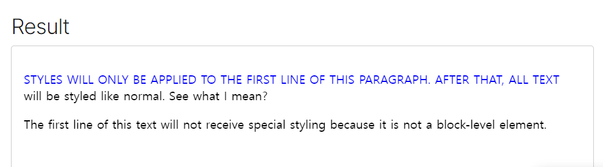
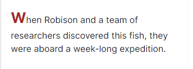
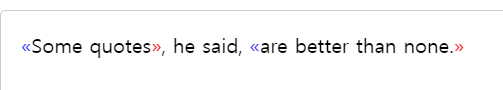
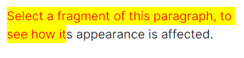
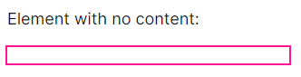
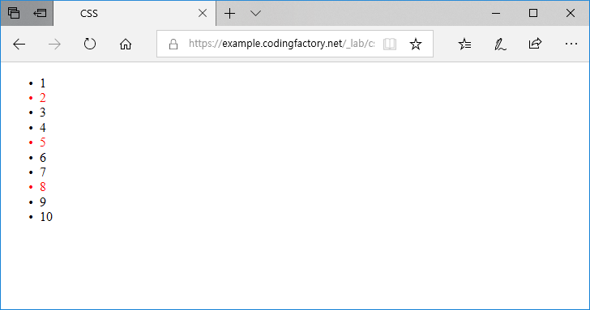
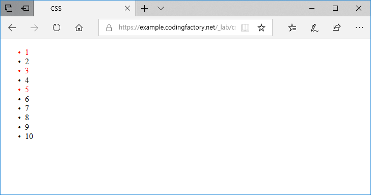

# CSS 파헤치기

선택자, 박스모델, media query, Flexbox, Grid

---

## 선택자

### CSS 선택자 (Selector)란?

특정 element를 선택하여 스타일을 적용할 수 있도록 하는 요소이다.

여러 종류가 있다.

1. 전체 선택자(Universal Selector)

    - 모든 HTML 요소를 선택한다. 별표 (*)로 나타냄.

      ```css
      * {
        color: blue;
      }
      ```

</br>

2. 타입 선택자(Type Selector)

    - h1, p, div, span 등 HTML elemenet(요소)를 선택하는 선택자이다.

      ```css
      p {
        color: blue;
      }
      ```

</br>

3. 속성 선택자(Attribute Selector)

    - 특정 속성을 갖고 있거나 특정 속성이 특정 값을 갖고 있는 elemenet(요소)를 선택한다.

    - [attributename]

      attributename 속성을 가진 요소를 선택한다.

      ```css
      h1[title]
      ```

      title속성을 가진 모든 h1요소를 선택함.

    - [attributename="value"]

      attributename 속성의 값이 value인 요소를 선택한다.

      ```css
      h1[title="abc"]
      ```

      title="abc" 속성을 가진 모든 h1요소를 선택함.

      주의할 점은 속성값이 정확히 일치해야 한다는 것이다!

      ```html
      <!-- O 선택됨 -->
      <h1 title="abc">Lorem</h1>

      <!-- X 선택 안됨 -->
      <h1 title="abc xyz">Lorem</h1>
      ```

      흠... 일부 일치만 해도 포함하게 하고 싶은데 어떻게 하면 될까?

    - [attributename~="value"]

      속성의 값이 value를 포함한 요소를 선택합니다. 일부 일치만 해도 선택됨.

      근데 단어 단위로 선택이 되니까 공백 기준으로 선택이 된다는 점에 유의!

      ```css
      h1[title~="abc"]
      ```

      title 속성값에 "abc"가 있는 요소를 찾는다.

      ```html
      <!-- O 선택됨 -->
      <h1 title="abc xyz">Lorem</h1>

      <!-- X 선택 안됨 -->
      <h1 title="abcxyz">Lorem</h1>
      ```

    - [attributename|="value"]

      attributename 속성의 값이 value이거나 value-로 시작하는 요소를 선택한다.

      유의할 점은 위에 attributename~="value" 와 달리 속성값에 "abc"를 포함하는 모든 요소를 선택하는 것이 아니라 "abc"로 시작하는 요소들을 찾는다는 것이다.

      ```css
      h1[title|="abc"]
      ```

      title="abc" 속성을 가지거나 "abc~~" 이렇게 시작하는 모든 h1요소를 선택함.

      ```html
      <!-- O 선택됨 -->
      <h1 title="abc">Lorem</h1>
      <h1 title="abc-xyz">Lorem</h1>

      <!-- X 선택 안됨 -->
      <h1 title="abc xyz">Lorem</h1>
      ```

    - [attributename^="value"]

      attributename 속성의 값이 value로 시작하는 요소를 선택한다.

      ```css
      h1[title^="abc"]
      ```

      단어 기준이 아니라 문자열 기준입니다. 따라서 다음 모두 선택됩니다.

      ```html
      <!-- O 선택됨 -->
      <h1 title="abc xyz">Lorem</h1>
      <h1 title="abc-xyz">Lorem</h1>
      ```

    - [attributename$="value"]

      attributename 속성의 값이 value로 끝나는 요소를 선택한다.

      ```css
      h1[title$="abc"]
      ```

      title의 속성값이 "abc"로 끝나는 모든 h1요소를 선택함.

      단어 기준이 아니라 문자열 기준입니다. 따라서 다음 모두 선택됩니다.

      ```html
      <!-- O 선택됨 -->
      <h1 title="xyz abc">Lorem</h1>
      <h1 title="xyz-abc">Lorem</h1>
      ```

    - [attributename*="value"]

      attributename 속성의 값이 value를 포함한 요소를 선택합니다.

      ```css
      h1[title*="abc"]
      ```

      title의 속성값이 "abc"를 포함한 모든 h1요소를 선택함.
      "abc"가 들어가기만 하면 선택됨

      ```html
        <!-- O 선택됨 -->
        <h1 title="abc xyz">Lorem</h1>
        <h1 title="abcxyz">Lorem</h1>
        <h1 title="lmn abc-xyz">Lorem</h1>
        ```

</br>

4. 아이디 선택자(ID Selector)

    특정 값을 id 속성(attribute)의 값으로 갖는 요소(element)를 선택합니다.

    속성값 앞에 #을 붙여 아이디임을 나타냅니다.

    ```css
    #abc {
      color: red;
    }
    ```

</br>

5. 클래스 선택자(Class Selector)

    특정 값을 class 속성(attribute)의 값으로 갖는 요소(element)를 선택합니다.

    속성값 앞에 .을 붙여 클래스임을 나타냅니다.

    ```css
    .abc {
      color: red;
    }
    ```

    - 클래스 선택자 앞에 element가 선언되어 있으면?

      해당 클래스를 가진 특정 element만 선택한다.

      ```css
      p.abc {
        color: red.;
      }
      ```

    - 클래스 속성의 값이 여러개이면?

      css 파일에서 나중에 선언된 것이 적용된다. 덮어쓴다.

      css

      ```css
      .abc {color: blue;}
      .xyz {color: red;}
      ```

      html

      ```html
      <p class="abc xyz">Lorem Ipsum Dolor.</p>
      <p class="xyz abc">Lorem Ipsum Dolor.</p>
      ```

      두개의 p element 모두 color:red 가 적용된다.

</br>

6. 하위 선택자(Descendant Selector)

    특정 요소 하위에 있는 요소를 선택하는 것

    ```css
    div p
    ```

    ```html
    <div>
      <p>...</p>
    </div>
    ```

    ```html
    <div>
      <span>
        <p>...</p>
      </span>
    </div>
    ```

    div와 p 사이에 다른 요소가 더 있어도 선택이 된다.

</br>

7. 자식 선택자(Child Selector)

    특정 요소의 자식 요소를 선택한다.

    주의할 점은 한단계 아래에 있는 요소만 선택한다는 점

    ```css
    div > p
    ```

    div 한 단계 아래에 있는 p를 선택한다.

    ```html
    <!-- O 선택됨 -->
    <div>
      <p>...</p>
    </div>
    ```

    ```html
    <!-- X 선택 안됨 -->
    <div>
      <span>
        <p>...</p>
      </span>
    </div>
    ```

</br>

8. 형제 선택자(Sibling Selector)

    어떤 요소의 형제 요소를 선택하는 선택자이다.

    ```css
    h1 ~ p
    ```

    h1 요소의 형제 요소 중 p 요소를 전부 선택한다.

</br>

9. 인접 형제 선택자(Adjacent Sibling Selector)

    어떤 요소의 형제 요소 중 첫 번째 요소를 선택한다.

    ```css
    h1 + p
    ```

10. 가상 요소(Pseudo-elements)

    가상요소는 요소의 특정 부분을 선택한다.

    ### ::first-line

    요소의 첫 번째 줄을 선택한다.

    ```css
    ::first-line {
      color: blue;
      text-transform: uppercase;
    }
    ```

    ```html
    <p>
      Styles will only be applied to the first line of this paragraph. After that,
      all text will be styled like normal. See what I mean?
    </p>
    ```

    

    화면상에서 첫번째 줄에 적용되는 것.

    첫 번째 줄의 길이는 요소의 너비, 문서의 너비, 텍스트의 글꼴 크기 등 여러 요인에 따라 달라진다.

    애매하기 때문에 확실히 하고 싶다면

    ```html
    <br/>
    ```

    br 태그로 첫번째 줄을 나눠주면 된다.

    </br>

    ### ::first-letter

    ```css
    p::first-letter {
        font-size: 1.5rem;
        font-weight: bold;
        color: brown;
    }
    ```

    ```html
    <p>When Robison and a team of researchers discovered this fish, they were aboard a week-long expedition.</p>
    ```

    

    </br>

    ### ::before

    ### ::after

    ```css
    q::before {
      content: "«";
      color: blue;
    }

    q::after {
      content: "»";
      color: red;
    }
    ```

    ```html
    <q>Some quotes</q>, he said, <q>are better than none.</q>
    ```

    

    </br>

    ### ::selection

    마우스 드래그 등으로 선택한 텍스트를 선택한다.

    ```html
    <p>Select a fragment of this paragraph, to see how its appearance is affected.</p>
    ```

    ```css
    p::selection {
        color: red;
        background-color: yellow;
    }
    ```

    

    </br>

11. 가상 클래스(Pseudo-class)

  ### :empty

  :empty는 내용이 없는 비어있는 요소를 선택합니다.

  주의할 점. 공백도 내용이 있는 것으로 봅니다. 따라서 다음처럼 빈 칸이 있는 것은 선택되지 않습니다.

  ```html
  <!-- X -->
  <div> </div>

  <!-- O -->
  <div></div>
  ```

  ```html
  <p>Element with no content:</p>
  <div></div>
  ```

  ```css
  div:empty {
      outline: 2px solid deeppink;
      height: 1em;
  }
  ```

  

  </br>

  ### :first-child

  형제 요소 중 첫번째 요소를 선택한다.

  ### :hover

  요소에 마우스를 올린 상태를 선택한다.

  ### :nth-child(숫자)

  정수가 들어간다.

  1, 3, 5 ... 이렇게 홀수번째만, 혹은 짝수번째만 하고 싶다면.

  ```.
  :nth-child( an+b )
  ```

  - a 와 b는 정수
  - n에는 0과 양수가 순서대로 들어간다. (0, 1, 2, 3)이 차례로 대입된다.

  ```html
  <ul>
    <li>1</li>
    <li>2</li>
    <li>3</li>
    <li>4</li>
    <li>5</li>
    <li>6</li>
    <li>7</li>
    <li>8</li>
    <li>9</li>
    <li>10</li>
  </ul>
  ```

  ```css
  li:nth-last-child( 3n+2 ) {
    color: red;
  }
  ```

  n에 0, 1, 2, 3, …을 대입하면 3n+2은 2, 5, 8, 11, …이 된다.

  

  </br>

  - an+b 대신에 even, odd를 넣을 수도 있다.

  ```css
  li:nth-child( -2n+5 ) {
    color: red;
  }
  ```

  a를 음수로 정하면 선택하는 요소의 개수를 정할 수 있다.

  n이 0일 때 5,

  n이 1일 때 3,

  n이 2일 때 1이므로,

  세 개의 홀수번째 요소가 선택된다.

  

  </br>

  ### :nth-last-child( an + b )

  :nth-last-child()는 형제 요소 중에서 특정 순서에 있는 요소를 선택할 때 사용합니다. 

  :nth-child()와 다른 점은 `뒤에서 부터 센다는 것`입니다

  a와 b는 정수입니다. 0과 음수도 가능합니다.

  n에는 음이 아닌 정수, 즉 0, 1, 2, 3, …이 차례대로 대입됩니다.

  an+b 대신에 even, odd를 넣을 수도 있습니다.

---

참고한 블로그

[css 선택자](https://www.codingfactory.net/12644)

[mdn 참고 문서](https://developer.mozilla.org/en-US/docs/Web/CSS/::after)

[mdn 참고 문서](https://developer.mozilla.org/en-US/docs/Web/CSS/:empty)
